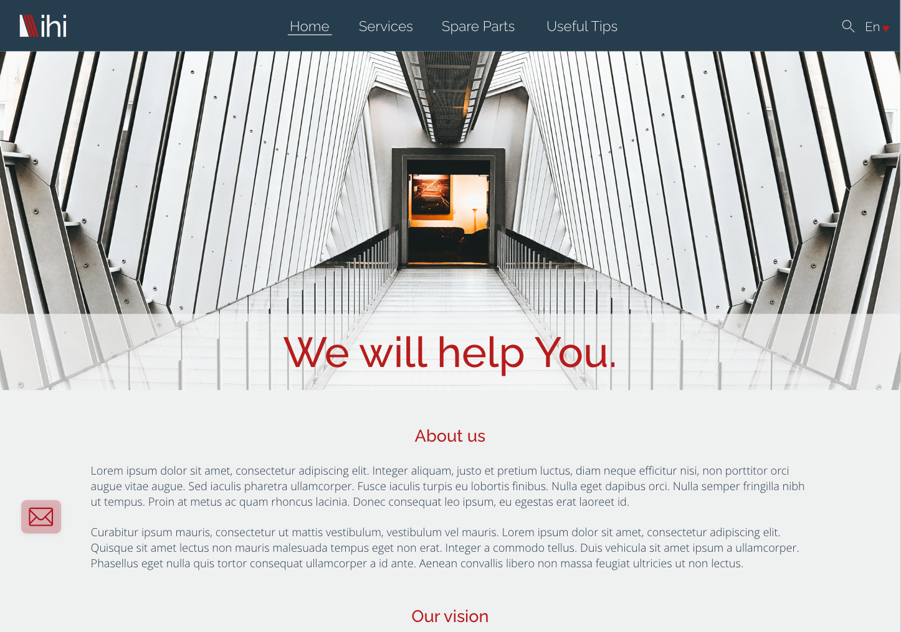
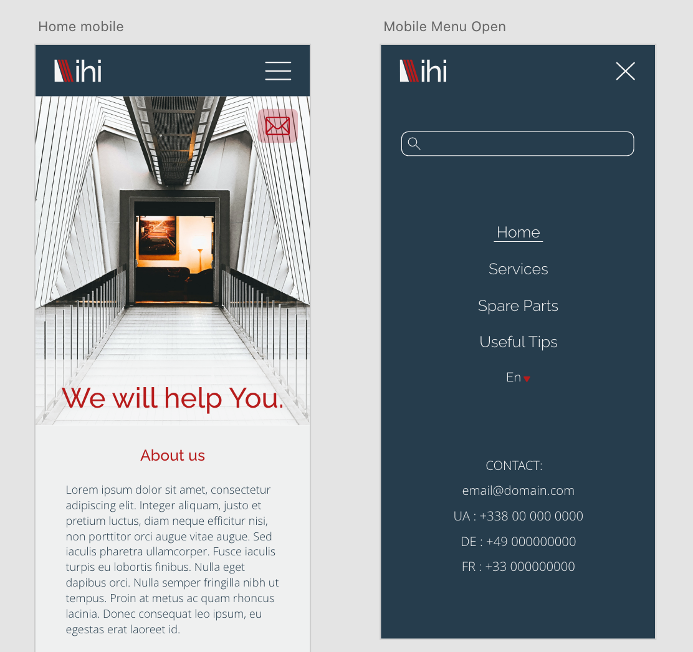
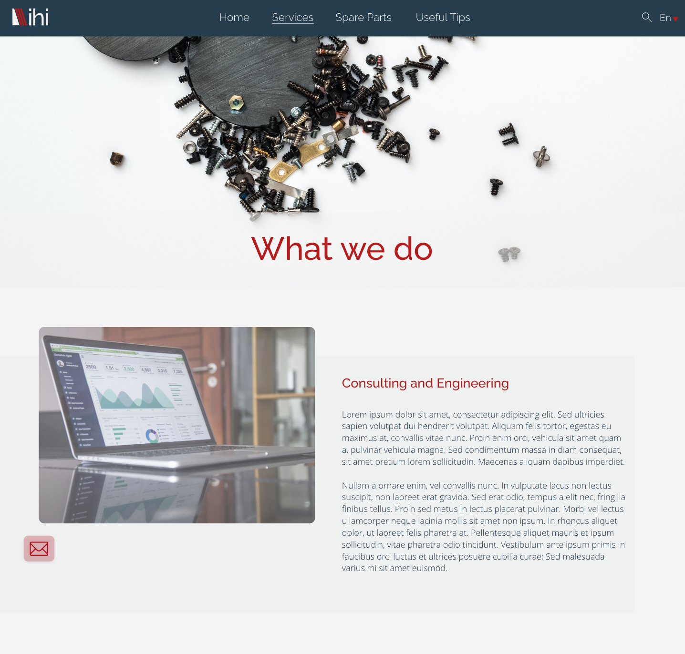
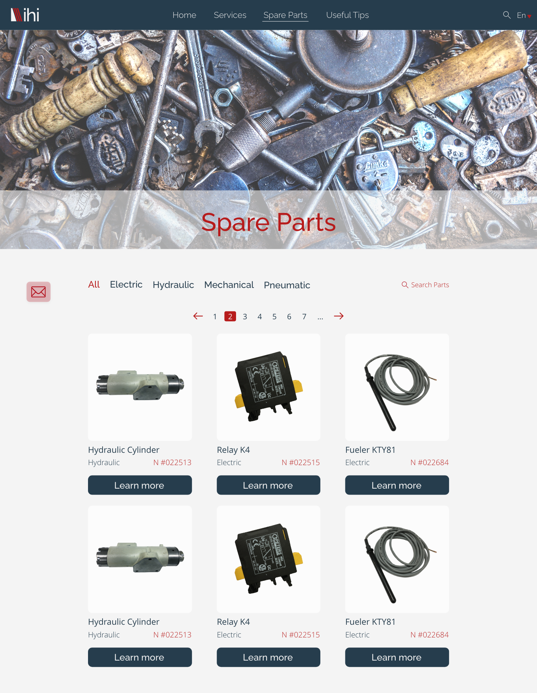
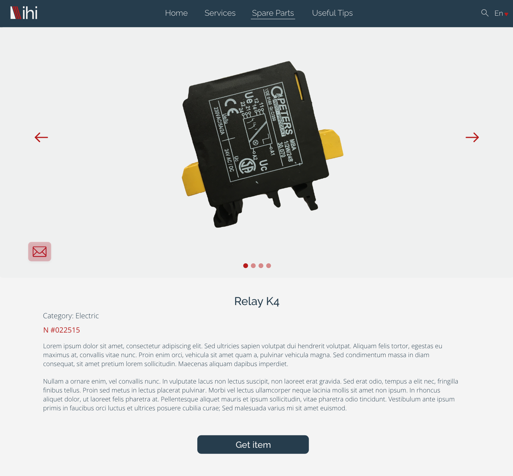
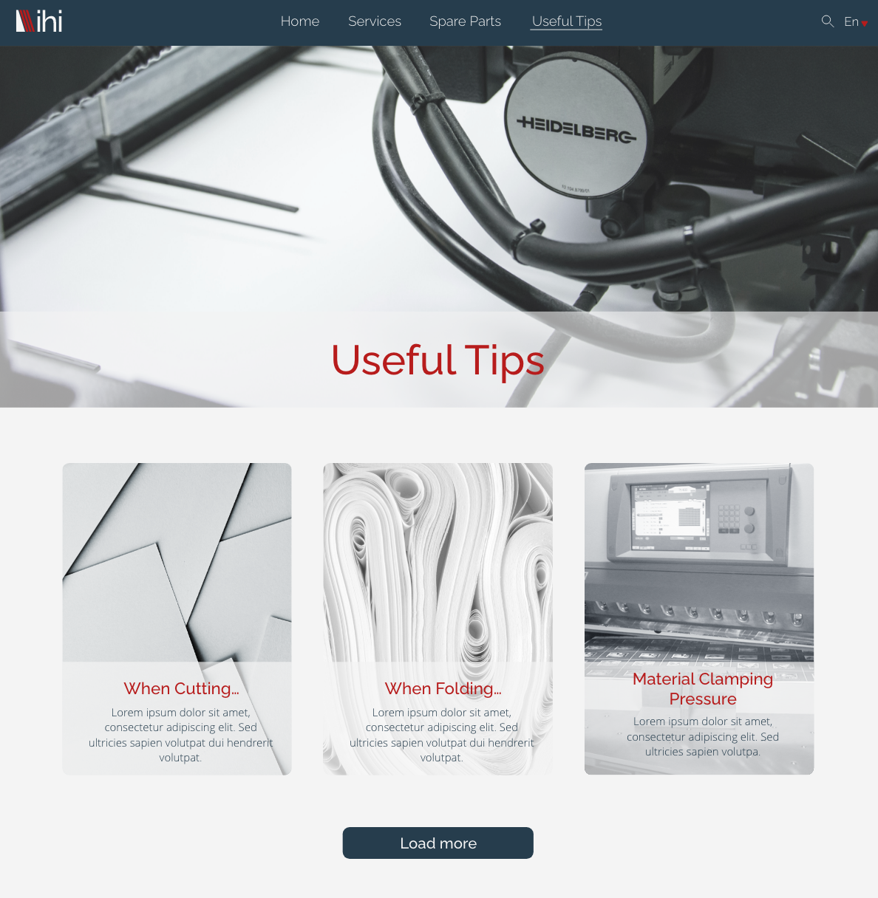
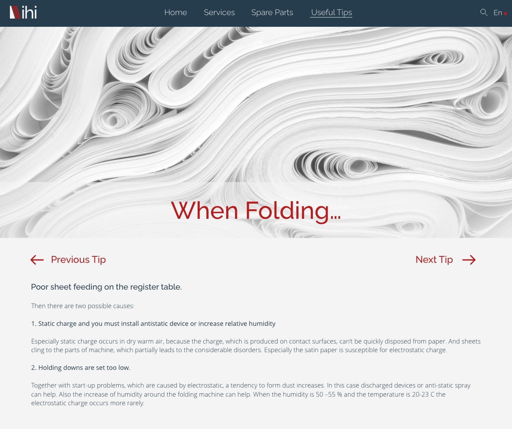
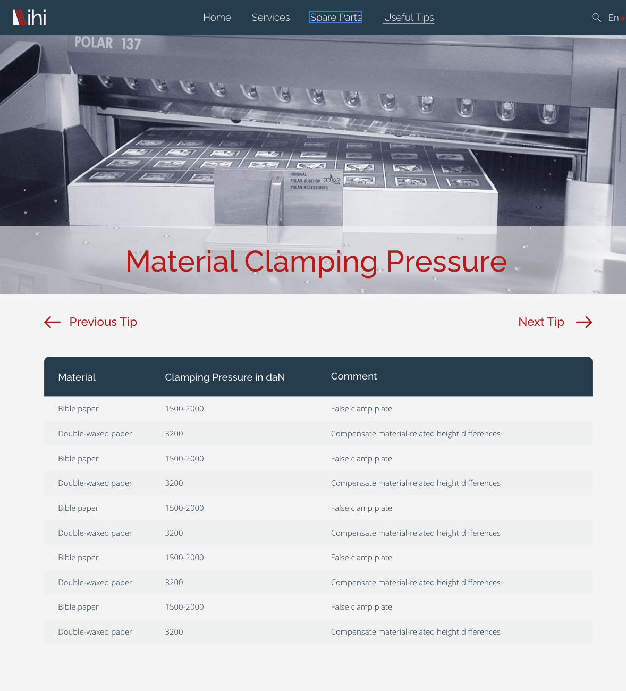

# Site internet pour une entreprise ukrainienne

**Description :**

Nouvelle version de ce site : un nouveau design et les nouvelles technologies.

**Lien vers l'ancien site :**  (https://ihi-immer.com/)

**Technologies utilisées :**
Angular, TypeScript, Sass

**Maquette Adobe XD :**
[Voir la maquette](https://xd.adobe.com/view/62362cf8-fe22-46ea-8111-4f785fd644c8-3765/grid "Maquette")

**Aperçu :**
  

 

  

 

 

 

  

  
